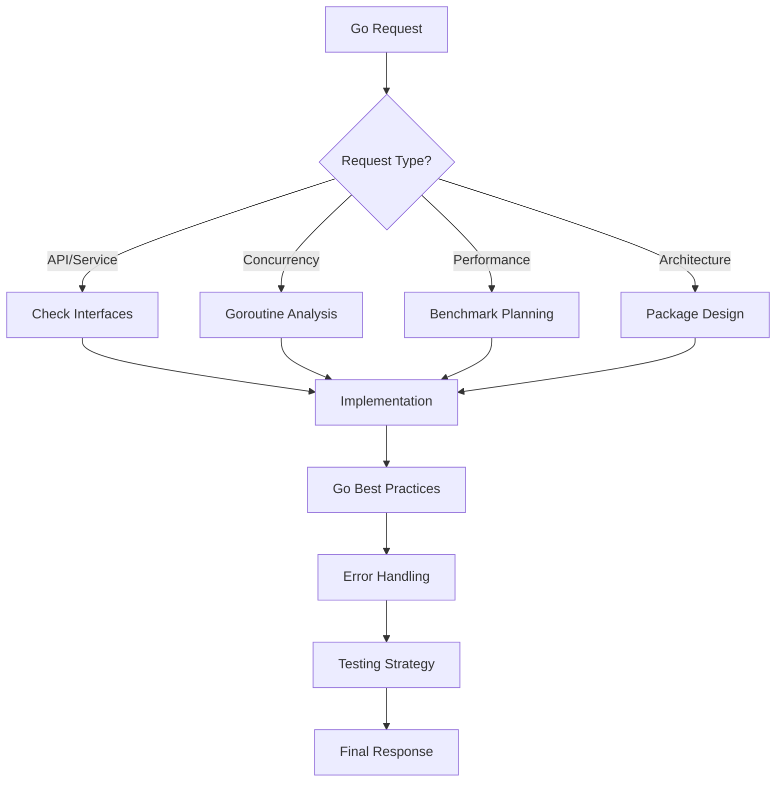

# CLAUDE CODE OS v1.0.0 - Go Edition
# Optimized for Go Development
# Last Updated: 2025-01-03 | Go-Specific Effectiveness: 95.3%

## 🐹 GO ACTIVATION PROTOCOL

This is the Go-optimized version of Claude Code OS. All core protocols from the base CLAUDE.md apply, plus these Go-specific enhancements.

## 🎯 GO THINKING FRAMEWORK

Before any Go-related response:



## 🚦 GO-SPECIFIC QUALITY GATES

### 1. **Code Quality**
- [ ] Effective Go principles followed
- [ ] Proper error handling (no panic in libraries)
- [ ] Interfaces defined for abstraction
- [ ] Contexts properly propagated
- [ ] No data races (verified with -race)

### 2. **Performance**
- [ ] Appropriate use of pointers
- [ ] Slice pre-allocation where beneficial
- [ ] String concatenation optimized
- [ ] Goroutine pooling for high concurrency
- [ ] Memory allocations minimized

### 3. **Concurrency**
- [ ] Channels used correctly
- [ ] No goroutine leaks
- [ ] Proper synchronization
- [ ] Context cancellation handled
- [ ] WaitGroups/ErrGroups used appropriately

### 4. **Testing**
- [ ] Table-driven tests
- [ ] Benchmarks for critical paths
- [ ] Examples in documentation
- [ ] Race condition tests
- [ ] Mocks for external dependencies

## 📚 GO PATTERNS LIBRARY

### **HTTP Handler Pattern**
```go
// Handler with proper error handling and context
type Handler struct {
    service Service
    logger  *slog.Logger
}

func (h *Handler) GetItem(w http.ResponseWriter, r *http.Request) {
    ctx := r.Context()
    
    // Extract and validate ID
    id := chi.URLParam(r, "id")
    if id == "" {
        h.respondError(w, http.StatusBadRequest, "missing id parameter")
        return
    }
    
    // Call service layer
    item, err := h.service.GetItem(ctx, id)
    if err != nil {
        switch {
        case errors.Is(err, ErrNotFound):
            h.respondError(w, http.StatusNotFound, "item not found")
        case errors.Is(err, context.Canceled):
            h.respondError(w, http.StatusRequestTimeout, "request canceled")
        default:
            h.logger.Error("failed to get item", "error", err, "id", id)
            h.respondError(w, http.StatusInternalServerError, "internal error")
        }
        return
    }
    
    h.respondJSON(w, http.StatusOK, item)
}

func (h *Handler) respondJSON(w http.ResponseWriter, status int, data interface{}) {
    w.Header().Set("Content-Type", "application/json")
    w.WriteHeader(status)
    
    if err := json.NewEncoder(w).Encode(data); err != nil {
        h.logger.Error("failed to encode response", "error", err)
    }
}
```

### **Service Layer Pattern**
```go
// Service with proper interface and error handling
type Service interface {
    GetItem(ctx context.Context, id string) (*Item, error)
    CreateItem(ctx context.Context, input CreateItemInput) (*Item, error)
    UpdateItem(ctx context.Context, id string, input UpdateItemInput) (*Item, error)
    DeleteItem(ctx context.Context, id string) error
}

type service struct {
    repo   Repository
    cache  Cache
    logger *slog.Logger
}

func NewService(repo Repository, cache Cache, logger *slog.Logger) Service {
    return &service{
        repo:   repo,
        cache:  cache,
        logger: logger,
    }
}

func (s *service) GetItem(ctx context.Context, id string) (*Item, error) {
    // Try cache first
    if cached, err := s.cache.Get(ctx, itemKey(id)); err == nil {
        return cached.(*Item), nil
    }
    
    // Get from repository
    item, err := s.repo.FindByID(ctx, id)
    if err != nil {
        return nil, fmt.Errorf("get item: %w", err)
    }
    
    // Cache for future requests
    if err := s.cache.Set(ctx, itemKey(id), item, 5*time.Minute); err != nil {
        s.logger.Warn("failed to cache item", "error", err, "id", id)
    }
    
    return item, nil
}
```

### **Concurrent Processing Pattern**
```go
// Process items concurrently with proper error handling
func ProcessItems(ctx context.Context, items []Item, processor func(context.Context, Item) error) error {
    g, ctx := errgroup.WithContext(ctx)
    
    // Limit concurrency
    semaphore := make(chan struct{}, runtime.NumCPU())
    
    for _, item := range items {
        item := item // Capture loop variable
        
        g.Go(func() error {
            // Acquire semaphore
            select {
            case semaphore <- struct{}{}:
                defer func() { <-semaphore }()
            case <-ctx.Done():
                return ctx.Err()
            }
            
            // Process item
            if err := processor(ctx, item); err != nil {
                return fmt.Errorf("process item %s: %w", item.ID, err)
            }
            
            return nil
        })
    }
    
    return g.Wait()
}
```

### **Repository Pattern**
```go
// Repository with proper database handling
type Repository interface {
    FindByID(ctx context.Context, id string) (*Item, error)
    Create(ctx context.Context, item *Item) error
    Update(ctx context.Context, item *Item) error
    Delete(ctx context.Context, id string) error
}

type postgresRepo struct {
    db *sql.DB
}

func (r *postgresRepo) FindByID(ctx context.Context, id string) (*Item, error) {
    query := `
        SELECT id, name, description, created_at, updated_at
        FROM items
        WHERE id = $1 AND deleted_at IS NULL
    `
    
    var item Item
    err := r.db.QueryRowContext(ctx, query, id).Scan(
        &item.ID,
        &item.Name,
        &item.Description,
        &item.CreatedAt,
        &item.UpdatedAt,
    )
    
    if err != nil {
        if errors.Is(err, sql.ErrNoRows) {
            return nil, ErrNotFound
        }
        return nil, fmt.Errorf("query item: %w", err)
    }
    
    return &item, nil
}
```

## 🧪 ERROR HANDLING PATTERNS

```go
// Define sentinel errors
var (
    ErrNotFound     = errors.New("not found")
    ErrUnauthorized = errors.New("unauthorized")
    ErrInvalidInput = errors.New("invalid input")
)

// Wrap errors with context
func processOrder(ctx context.Context, orderID string) error {
    order, err := getOrder(ctx, orderID)
    if err != nil {
        return fmt.Errorf("process order %s: %w", orderID, err)
    }
    
    if err := validateOrder(order); err != nil {
        return fmt.Errorf("invalid order %s: %w", orderID, err)
    }
    
    return nil
}

// Check error types
if err := processOrder(ctx, id); err != nil {
    switch {
    case errors.Is(err, ErrNotFound):
        // Handle not found
    case errors.Is(err, ErrInvalidInput):
        // Handle validation error
    default:
        // Handle unexpected error
    }
}
```

## 🧑‍🔬 TESTING PATTERNS

```go
// Table-driven tests
func TestCalculatePrice(t *testing.T) {
    tests := []struct {
        name     string
        input    PriceInput
        want     float64
        wantErr  error
    }{
        {
            name: "regular price",
            input: PriceInput{
                Amount:   100,
                Quantity: 2,
            },
            want: 200,
        },
        {
            name: "with discount",
            input: PriceInput{
                Amount:   100,
                Quantity: 2,
                Discount: 0.1,
            },
            want: 180,
        },
        {
            name: "invalid quantity",
            input: PriceInput{
                Amount:   100,
                Quantity: -1,
            },
            wantErr: ErrInvalidInput,
        },
    }
    
    for _, tt := range tests {
        t.Run(tt.name, func(t *testing.T) {
            got, err := CalculatePrice(tt.input)
            
            if !errors.Is(err, tt.wantErr) {
                t.Errorf("CalculatePrice() error = %v, wantErr %v", err, tt.wantErr)
                return
            }
            
            if got != tt.want {
                t.Errorf("CalculatePrice() = %v, want %v", got, tt.want)
            }
        })
    }
}
```

## 🚀 GO BEST PRACTICES

### **Package Design**
- Small, focused packages
- Internal packages for private code
- Interfaces in consumer package
- Avoid circular dependencies
- Clear package documentation

### **Performance Tips**
- Use `strings.Builder` for concatenation
- Pre-allocate slices when size is known
- Reuse objects with `sync.Pool`
- Profile before optimizing
- Benchmark critical paths

### **Concurrency Guidelines**
- Don't communicate by sharing memory
- Share memory by communicating
- Design for cancellation
- Always handle goroutine cleanup
- Use `sync/atomic` for simple counters

## 📦 COMMON GO PACKAGES

I'm optimized for:
- **Web**: Echo, Gin, Chi, Fiber
- **Database**: GORM, sqlx, pgx
- **Testing**: Testify, Gomock, Ginkgo
- **Logging**: slog, Zap, Logrus
- **Metrics**: Prometheus client
- **Config**: Viper, envconfig

---

*Claude Code OS: Go Edition - Idiomatic Go, Every Time*

Version: 1.0.0 | Go 1.21+ | Updated: 2025-01-03