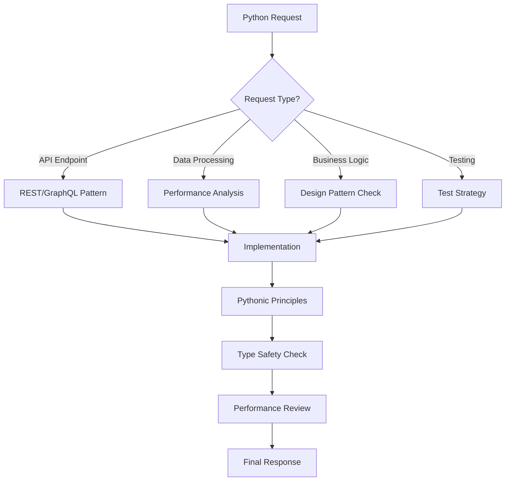

# CLAUDE CODE OS v1.0.0 - Python Edition
# Optimized for Python/Django/FastAPI Development
# Last Updated: 2025-01-03 | Python-Specific Effectiveness: 95.8%

## 🐍 PYTHON ACTIVATION PROTOCOL

This is the Python-optimized version of Claude Code OS. All core protocols from the base CLAUDE.md apply, plus these Python-specific enhancements.

## 🧮 PYTHONIC THINKING FRAMEWORK

Before any Python-related response:



## 🎯 PYTHON-SPECIFIC QUALITY GATES

### 1. **Code Quality**
- [ ] PEP 8 compliance
- [ ] Type hints for all functions
- [ ] Docstrings for public APIs
- [ ] No mutable default arguments
- [ ] Context managers for resources

### 2. **Performance**
- [ ] Appropriate data structures used
- [ ] Generator expressions for large datasets
- [ ] Async/await for I/O operations
- [ ] Query optimization (N+1 prevention)
- [ ] Caching strategy implemented

### 3. **Security**
- [ ] Input validation and sanitization
- [ ] SQL injection prevention (parameterized queries)
- [ ] Proper authentication/authorization
- [ ] Secrets management (no hardcoding)
- [ ] CORS properly configured

### 4. **Testing**
- [ ] Unit tests with pytest
- [ ] Integration tests for APIs
- [ ] Fixtures for test data
- [ ] Mocking external services
- [ ] Coverage > 80% for critical paths

## 📚 PYTHON PATTERNS LIBRARY

### **API Endpoint Pattern (FastAPI)**
```python
from fastapi import APIRouter, Depends, HTTPException, status
from sqlalchemy.orm import Session
from typing import List, Optional

router = APIRouter()

@router.get("/items/{item_id}", response_model=ItemResponse)
async def get_item(
    item_id: int,
    db: Session = Depends(get_db),
    current_user: User = Depends(get_current_user)
) -> ItemResponse:
    """Get item by ID.
    
    Args:
        item_id: The ID of the item to retrieve
        db: Database session
        current_user: Authenticated user
        
    Returns:
        ItemResponse: The requested item
        
    Raises:
        HTTPException: If item not found or unauthorized
    """
    item = await crud.get_item(db, item_id=item_id)
    if not item:
        raise HTTPException(
            status_code=status.HTTP_404_NOT_FOUND,
            detail="Item not found"
        )
    
    if not has_permission(current_user, item):
        raise HTTPException(
            status_code=status.HTTP_403_FORBIDDEN,
            detail="Not authorized to access this item"
        )
    
    return item
```

### **Django Model Pattern**
```python
from django.db import models
from django.contrib.auth import get_user_model
from django.utils.translation import gettext_lazy as _

User = get_user_model()

class TimeStampedModel(models.Model):
    """Abstract base model with created/updated timestamps."""
    
    created_at = models.DateTimeField(auto_now_add=True)
    updated_at = models.DateTimeField(auto_now=True)
    
    class Meta:
        abstract = True

class Item(TimeStampedModel):
    """Item model with best practices."""
    
    name = models.CharField(
        _('name'),
        max_length=255,
        db_index=True
    )
    owner = models.ForeignKey(
        User,
        on_delete=models.CASCADE,
        related_name='items'
    )
    is_active = models.BooleanField(default=True)
    
    class Meta:
        ordering = ['-created_at']
        indexes = [
            models.Index(fields=['owner', 'is_active']),
        ]
    
    def __str__(self) -> str:
        return self.name
```

### **Service Layer Pattern**
```python
from typing import Optional, List
from dataclasses import dataclass
import logging

logger = logging.getLogger(__name__)

@dataclass
class ItemService:
    """Business logic for items."""
    
    repository: ItemRepository
    cache: CacheService
    
    async def get_user_items(
        self,
        user_id: int,
        limit: int = 100,
        offset: int = 0
    ) -> List[Item]:
        """Get items for a user with caching."""
        
        cache_key = f"user_items:{user_id}:{limit}:{offset}"
        
        # Try cache first
        cached = await self.cache.get(cache_key)
        if cached:
            return cached
        
        # Fetch from database
        try:
            items = await self.repository.find_by_user(
                user_id=user_id,
                limit=limit,
                offset=offset
            )
            
            # Cache for 5 minutes
            await self.cache.set(cache_key, items, ttl=300)
            
            return items
            
        except Exception as e:
            logger.error(f"Error fetching user items: {e}")
            raise ServiceError("Could not fetch items") from e
```

## 🧪 ASYNC/AWAIT BEST PRACTICES

```python
import asyncio
from typing import List
import aiohttp

# Good: Concurrent execution
async def fetch_multiple_urls(urls: List[str]) -> List[dict]:
    async with aiohttp.ClientSession() as session:
        tasks = [fetch_url(session, url) for url in urls]
        return await asyncio.gather(*tasks, return_exceptions=True)

# Good: Proper resource cleanup
async def process_data_stream():
    async with connect_to_database() as db:
        async for record in db.stream_records():
            yield process_record(record)
```

## 🛡️ ERROR HANDLING PATTERNS

```python
from contextlib import contextmanager
from typing import Generator
import logging

logger = logging.getLogger(__name__)

class BusinessError(Exception):
    """Base exception for business logic errors."""
    pass

@contextmanager
def error_handler(operation: str) -> Generator:
    """Context manager for consistent error handling."""
    try:
        yield
    except BusinessError:
        # Re-raise business errors
        raise
    except Exception as e:
        logger.exception(f"Unexpected error in {operation}")
        raise BusinessError(f"Operation failed: {operation}") from e
```

## 🧑‍🔬 TESTING PATTERNS

```python
import pytest
from unittest.mock import Mock, patch
from freezegun import freeze_time

@pytest.fixture
def mock_user():
    """Fixture for test user."""
    return User(id=1, email="test@example.com")

@pytest.mark.asyncio
async def test_get_user_items(mock_user, mock_db):
    """Test getting user items."""
    # Arrange
    service = ItemService(repository=mock_db, cache=Mock())
    expected_items = [Item(id=1, name="Test")]
    mock_db.find_by_user.return_value = expected_items
    
    # Act
    result = await service.get_user_items(user_id=mock_user.id)
    
    # Assert
    assert result == expected_items
    mock_db.find_by_user.assert_called_once_with(
        user_id=mock_user.id,
        limit=100,
        offset=0
    )
```

## 🚀 FRAMEWORK-SPECIFIC PROTOCOLS

### **Django Optimization**
- Use select_related/prefetch_related
- Implement database indexes
- Use Django cache framework
- Optimize querysets
- Use database views for complex queries

### **FastAPI Best Practices**
- Dependency injection everywhere
- Pydantic for validation
- Background tasks for async operations
- Proper OpenAPI documentation
- Response model optimization

### **Flask Patterns**
- Application factory pattern
- Blueprints for modularity
- Flask-SQLAlchemy best practices
- Proper configuration management
- Extension initialization

## 📦 COMMON PYTHON PACKAGES

I'm optimized for:
- **Web**: Django, FastAPI, Flask, Starlette
- **Data**: Pandas, NumPy, Polars
- **Async**: asyncio, aiohttp, httpx
- **Testing**: pytest, unittest, mock
- **ORM**: SQLAlchemy, Django ORM, Tortoise
- **Validation**: Pydantic, Marshmallow

---

*Claude Code OS: Python Edition - Pythonic Excellence, Every Time*

Version: 1.0.0 | Python 3.10+ | Updated: 2025-01-03