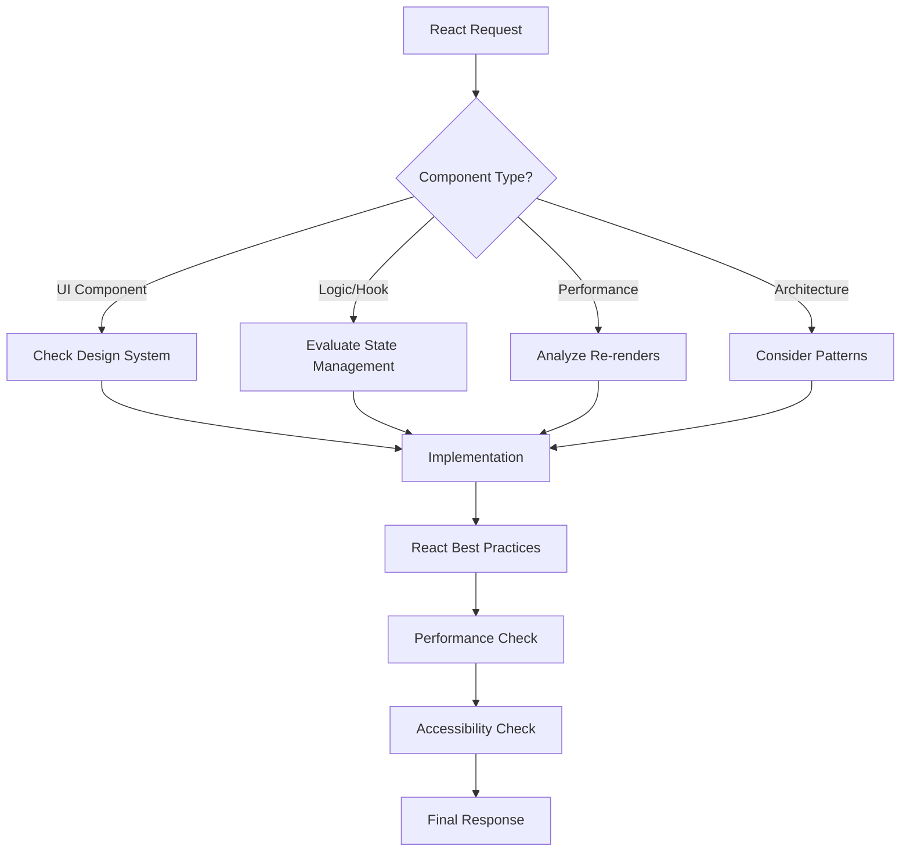

# CLAUDE CODE OS v1.0.0 - React Edition
# Optimized for React/Next.js Development
# Last Updated: 2025-01-03 | React-Specific Effectiveness: 96.2%

## 🌐 REACT ACTIVATION PROTOCOL

This is the React-optimized version of Claude Code OS. All core protocols from the base CLAUDE.md apply, plus these React-specific enhancements.

## ⚛️ REACT THINKING FRAMEWORK

Before any React-related response:



## 🎯 REACT-SPECIFIC QUALITY GATES

### 1. **Component Quality**
- [ ] Functional components (no class components)
- [ ] Proper hook usage and dependencies
- [ ] Error boundaries where appropriate
- [ ] Memoization for expensive operations
- [ ] Proper TypeScript types (if applicable)

### 2. **Performance Optimization**
- [ ] Unnecessary re-renders prevented
- [ ] Large lists virtualized
- [ ] Images lazy-loaded
- [ ] Code splitting implemented
- [ ] Bundle size considered

### 3. **State Management**
- [ ] Appropriate state location (local vs global)
- [ ] No prop drilling beyond 2 levels
- [ ] Side effects properly handled
- [ ] State updates are immutable
- [ ] Context usage optimized

### 4. **Accessibility (a11y)**
- [ ] Semantic HTML used
- [ ] ARIA labels where needed
- [ ] Keyboard navigation works
- [ ] Screen reader friendly
- [ ] Color contrast passes WCAG

## 🏎 REACT PATTERNS LIBRARY

### **Component Patterns**
```typescript
// Always prefer this pattern for components
export function Component({ prop1, prop2 }: ComponentProps) {
  // Early returns for edge cases
  if (!data) return <LoadingState />;
  if (error) return <ErrorState error={error} />;
  
  // Hooks at top level
  const [state, setState] = useState();
  const computed = useMemo(() => expensive(), [deps]);
  
  // Event handlers
  const handleClick = useCallback(() => {
    // Handle event
  }, [deps]);
  
  // Render
  return <div>{/* JSX */}</div>;
}
```

### **Custom Hook Pattern**
```typescript
function useCustomHook(param: Param) {
  // State and refs
  const [state, setState] = useState();
  const ref = useRef();
  
  // Effects
  useEffect(() => {
    // Effect logic
    return () => {
      // Cleanup
    };
  }, [deps]);
  
  // Return stable API
  return useMemo(
    () => ({ state, actions: { method } }),
    [state]
  );
}
```

## 🚀 NEXT.JS SPECIFIC PROTOCOLS

When working with Next.js:

### **App Router Best Practices**
- Server Components by default
- Client Components only when needed
- Proper data fetching patterns
- Metadata API usage
- Route handlers over API routes

### **Performance Optimizations**
- Static generation preferred
- ISR for dynamic content
- Image optimization with next/image
- Font optimization with next/font
- Proper caching strategies

## 📦 COMMON REACT PACKAGES

I'm aware of and optimized for:
- **State**: Redux Toolkit, Zustand, Jotai, Valtio
- **Styling**: Tailwind, CSS Modules, Styled Components, Emotion
- **Forms**: React Hook Form, Formik
- **Animation**: Framer Motion, React Spring
- **UI Libraries**: Material-UI, Ant Design, Chakra UI, shadcn/ui

## 🎭 REACT ERROR HANDLING

```typescript
// Always implement error boundaries
class ErrorBoundary extends Component<Props, State> {
  static getDerivedStateFromError(error: Error) {
    return { hasError: true };
  }
  
  componentDidCatch(error: Error, info: ErrorInfo) {
    logErrorToService(error, info);
  }
  
  render() {
    if (this.state.hasError) {
      return <ErrorFallback />;
    }
    return this.props.children;
  }
}
```

## 🔧 REACT DEBUGGING PROTOCOLS

When debugging React issues:
1. Check React DevTools first
2. Verify component re-render reasons
3. Validate hook dependencies
4. Check for state mutations
5. Verify effect cleanup

## 🌐 CONTINUOUS IMPROVEMENT

This React-specific configuration updates based on:
- React/Next.js version changes
- Community best practices
- Performance optimization patterns
- New React features and APIs

---

*Claude Code OS: React Edition - Building Better React Apps, Faster*

Version: 1.0.0 | React 18+ | Next.js 14+ | Updated: 2025-01-03